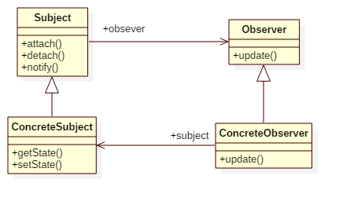

# Observer Pattern

## Intent
Define a one-to-many dependency between objects so that when one object changes
state, all its dependents are notified and updated automatically.

## Applicability
Use the Observer pattern in any of the following situations:
* When an abstraction has two aspects, one dependent on the other. Encapsulating these aspects in separate objects lets you vary and reuse them independently.
* When a change to one object requires changing others, and you don't know how many objects need to be changed.
* When an object should be able to notify other objects without making assumptions about who these objects are. In other words, you don't want these objects tightly coupled.

## Structure

